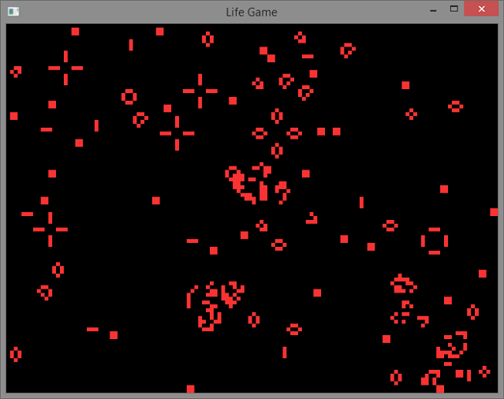

Изучение поведения клеточного автомата путём реализации игры "Жизнь"

О программе:
Графическая оболочка реализована с помощью SFML библиотеки с использованием язык C++.

    
    
Демонстрация работы программы

